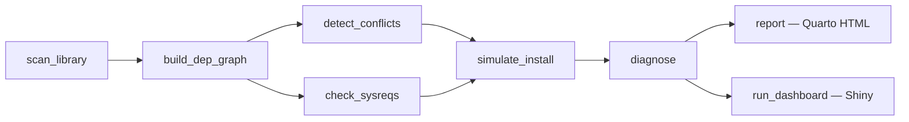

# buildwright

**Dependency-health and build-failure diagnostics for managed R
environments.**

[](https://github.com/ashenoy/buildwright/actions/workflows/R-CMD-check.yaml)
[](https://ashenoy.github.io/buildwright/)
[](https://app.codecov.io/gh/ashenoy/buildwright?branch=main)
[](https://lifecycle.r-lib.org/articles/stages.html#experimental)
[](https://www.gnu.org/licenses/gpl-3.0)

------------------------------------------------------------------------

buildwright predicts dependency failures in large, managed R package
distributions **before** any install is attempted. It scans `renv`
lockfiles and installed libraries, constructs a dependency graph,
detects version conflicts and cycles, maps packages to their
system-library requirements, and simulates the full install sequence to
surface every blocked package in advance. Results are available as a
static Quarto HTML report, an interactive Shiny dashboard, or a
fail-fast CI hook that gates
[`renv::restore()`](https://rstudio.github.io/renv/reference/restore.html)
and `pak` installs.

------------------------------------------------------------------------

## Why this exists

Running a 300-package internal distribution on Posit Connect or Posit
Workbench is operationally hard. A single transitive version bump—buried
four levels deep—or one missing system library can break a fresh install
halfway through, leaving a half-configured environment and a wall of
opaque error messages. Common pain points:

- **Late failure.** A missing system library (libgdal, libpq, V8) causes
  `rgdal`, `RPostgres`, or `V8` to fail at compile time, often only
  discovered after a 20-minute install run.
- **Unsatisfiable version ranges.** Package A requires `rlang >= 1.1.0`;
  package B was coded against `rlang <= 0.4.12`. Both constraints can
  sit undetected in a lockfile for months.
- **Cycle detection.** Circular `Imports` entries in internal packages
  quietly poison igraph’s topological sort, producing random install
  orderings that fail non-deterministically.
- **Bioconductor release mismatches.** A lockfile pinned to Bioc 3.13
  silently conflicts with packages that require Bioc 3.14 APIs.
- **No early warning.** Neither
  [`renv::restore()`](https://rstudio.github.io/renv/reference/restore.html)
  nor
  [`pak::pkg_install()`](https://pak.r-lib.org/reference/pkg_install.html)
  performs a pre-flight dependency-satisfiability check; they discover
  problems during or after install.
- **Audit fatigue.** Platform engineers have no lightweight way to run a
  nightly dependency-health scan against a live lockfile and receive a
  structured diff when something regresses.

buildwright addresses each of these with a single
[`diagnose()`](https://ashenoy.github.io/buildwright/reference/diagnose.md)
call and a Quarto report you can schedule on Connect.

------------------------------------------------------------------------

## Installation

``` r

# Recommended (pak resolves dependencies in parallel):
pak::pak("ashenoy/buildwright")

# Or with remotes:
remotes::install_github("ashenoy/buildwright")
```

Requires R \>= 4.2. Core Imports are available on CRAN. Suggested
packages (shiny, visNetwork, renv, pak, etc.) are only needed for the
corresponding features and are loaded lazily.

------------------------------------------------------------------------

## 30-second quickstart

``` r

library(buildwright)

# diagnose() runs the full pipeline in one call
diag <- diagnose(bw_example("conflicted.lock"))
print(diag)

# Drill into individual components
conflicts <- detect_conflicts(bw_example("conflicted.lock"))
plan      <- simulate_install(bw_example("conflicted.lock"))

# Render a self-contained HTML report
report(bw_example("conflicted.lock"), format = "quarto")

# Or launch the interactive Shiny dashboard
report(bw_example("conflicted.lock"), format = "shiny")
```

**What `print(diag)` looks like** for `conflicted.lock` (9 packages, 4
conflict types, 6 predicted failures):

    ── buildwright diagnosis ───────────────────────────────────────────────────────
      Input  : conflicted.lock
      Type   : lockfile
      R      : 4.3.1
      Bioc   : (none)
      Packages: 9

    ── Conflicts (4) ───────────────────────────────────────────────────────────────
      ✖ zeta          [missing]           required by: alpha
      ✖ rlang         [version_conflict]  needsNewRlang (>=1.1.0) vs needsOldRlang (<=0.4.12)
      ✖ cli           [version_drift]     wantsRecentCli requires >=99.0.0; installed 3.6.2
      ✖ ouroboros     [cycle]             ouroboros <-> boros

    ── System requirements ─────────────────────────────────────────────────────────
      ✔ No system requirements mapped (platform: linux)

    ── Install simulation ──────────────────────────────────────────────────────────
      ✖ Feasible    : FALSE
      ● ok          : 3
      ● warn        : 0
      ✖ fail/blocked: 6
        - rlang          fail      (unsatisfiable version constraints)
        - alpha          blocked   (missing dependency: zeta)
        - needsNewRlang  blocked   (dependency failed: rlang)
        - needsOldRlang  blocked   (dependency failed: rlang)
        - ouroboros      blocked   (cycle)
        - boros          blocked   (cycle)
    ────────────────────────────────────────────────────────────────────────────────

------------------------------------------------------------------------

## Architecture

### Mermaid diagram



### ASCII fallback

    scan_library
        |
        v
    build_dep_graph
        |
        +---> detect_conflicts ---+
        |                         |
        +---> check_sysreqs ------+
                                  |
                                  v
                            simulate_install
                                  |
                                  v
                               diagnose
                                  |
                     +------------+------------+
                     |                         |
             report (Quarto HTML)    run_dashboard (Shiny)

------------------------------------------------------------------------

## Feature map

| Function | What it does |
|----|----|
| [`scan_library()`](https://ashenoy.github.io/buildwright/reference/scan_library.md) | Reads an `renv.lock` or installed library into a tidy `bw_library` tibble with canonical sources (CRAN / Bioconductor / GitHub / local). |
| [`build_dep_graph()`](https://ashenoy.github.io/buildwright/reference/build_dep_graph.md) | Builds an `igraph` DAG from declared `Imports`/`Depends`/`LinkingTo`. Edge A→B means A requires B. Helpers: [`bw_cycles()`](https://ashenoy.github.io/buildwright/reference/bw_cycles.md), [`bw_diamonds()`](https://ashenoy.github.io/buildwright/reference/bw_diamonds.md), [`bw_graph_data()`](https://ashenoy.github.io/buildwright/reference/bw_graph_data.md). |
| [`detect_conflicts()`](https://ashenoy.github.io/buildwright/reference/detect_conflicts.md) | Returns a `bw_conflicts` tibble with four conflict types: `missing`, `version_conflict`, `version_drift`, `cycle`. Zero rows when healthy. |
| [`check_sysreqs()`](https://ashenoy.github.io/buildwright/reference/check_sysreqs.md) | Maps packages to system libraries via an offline knowledge base; reports `ok`/`missing`/`unknown` per platform (linux/macos/windows). Optional `pak` path for richer data. |
| [`simulate_install()`](https://ashenoy.github.io/buildwright/reference/simulate_install.md) | Produces a dependency-first install order and predicts `ok`/`warn`/`fail`/`blocked` status for every package before a single install is run. |
| [`diagnose()`](https://ashenoy.github.io/buildwright/reference/diagnose.md) | Runs the full pipeline and returns a `bw_diagnosis` list with `$library`, `$graph`, `$conflicts`, `$sysreqs`, `$plan`, and `$meta`. `summary(diag)` returns a 2-column metric/value tibble. |

------------------------------------------------------------------------

## Posit Connect deployment

### Parameterised Quarto report

The bundled report at `inst/report/buildwright_report.qmd` accepts a
`data_rds` parameter pointing to a serialised `bw_diagnosis` object.
Deploy it to Connect once; then schedule it to run nightly against a
live `renv.lock` by passing a fresh `data_rds` each run.

``` r

# 1. Serialise the diagnosis
diag <- diagnose("path/to/renv.lock", platform = "linux")
saveRDS(diag, "latest_diagnosis.rds")

# 2. Deploy the report (first time)
rsconnect::deployApp(
  appDir        = system.file("report", package = "buildwright"),
  appName       = "dependency-health",
  appFiles      = c("buildwright_report.qmd"),
  forceUpdate   = TRUE
)

# 3. Or publish with the Quarto CLI
# quarto publish connect inst/report/buildwright_report.qmd
```

Set the report’s `data_rds` parameter on the Connect scheduling UI (or
via the Connect API) to the path of the RDS file written by your nightly
pipeline. The scheduled run acts as a persistent dependency-health
audit: any regressions appear in the next morning’s report.

### Shiny dashboard

``` r

# Deploy the interactive dashboard to Connect
rsconnect::deployApp(
  appDir  = system.file("shiny", package = "buildwright"),
  appName = "buildwright-dashboard"
)
```

The Shiny app reads its diagnosis from
`getOption("buildwright.dashboard_data")`. Set that option in a
`global.R` wrapper, or let it fall back to the bundled `conflicted.lock`
fixture when running standalone for a demo.

------------------------------------------------------------------------

## Pre-install hook

Run
[`bw_preinstall_check()`](https://ashenoy.github.io/buildwright/reference/bw_preinstall_check.md)
before
[`renv::restore()`](https://rstudio.github.io/renv/reference/restore.html)
or
[`pak::pkg_install()`](https://pak.r-lib.org/reference/pkg_install.html)
to abort early when the lockfile is unhealthy. Pass `strict = TRUE` to
turn warnings into errors.

``` r

# In a project .Rprofile or setup script:
buildwright::bw_preinstall_check("renv.lock", strict = TRUE)
renv::restore()
```

``` r

# With pak:
buildwright::bw_preinstall_check("renv.lock", strict = TRUE)
pak::pkg_install(pak::lockfile_read("renv.lock"))
```

As a CI gate (e.g., GitHub Actions, Jenkins):

``` bash
Rscript -e "buildwright::bw_preinstall_check('renv.lock', strict = TRUE)"
```

The script exits with a non-zero status when `strict = TRUE` and any
conflicts or predicted failures are found, blocking the pipeline before
a long install is attempted.

------------------------------------------------------------------------

## Links

- **pkgdown site**: <https://ashenoy.github.io/buildwright/>
- **Getting started vignette**:
  <https://ashenoy.github.io/buildwright/articles/buildwright.html>
- **Cookbook** (platform-eng recipes):
  <https://ashenoy.github.io/buildwright/articles/cookbook.html>
- **Bug reports**: <https://github.com/ashenoy/buildwright/issues>

------------------------------------------------------------------------

## License

GPL-3. See [LICENSE](https://ashenoy.github.io/buildwright/LICENSE) for
details.
